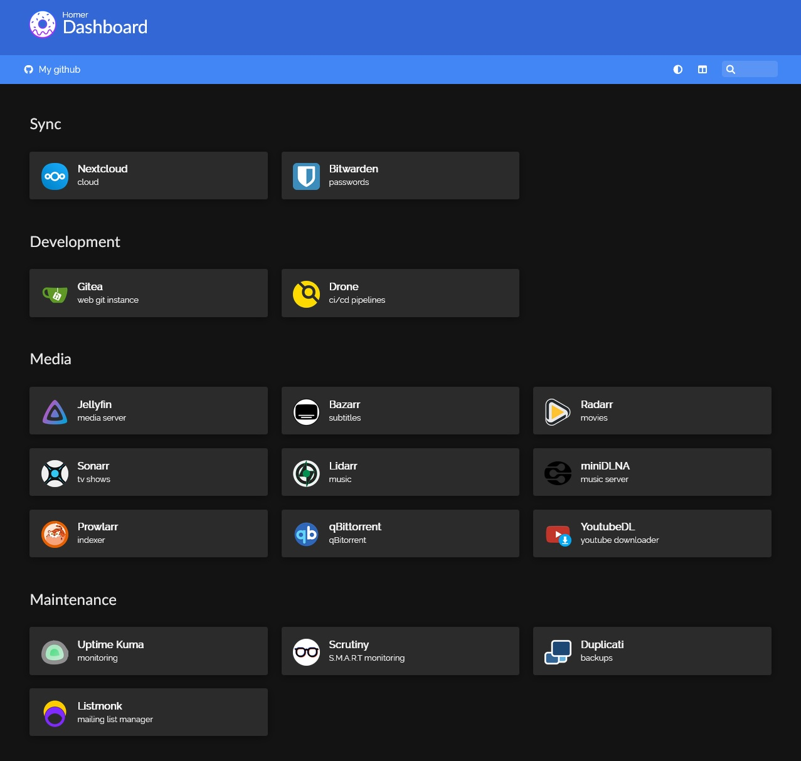

# mr-vercetti/homeserver

This is my home server project that I started because I value the privacy of my data, I don't like paying subscriptions and because self-hosting is really fucking cool.

## Core services
All services are deployed using Docker compose and are run as a non-root user.

### Maintenance
* [ddclient](https://github.com/linuxserver/docker-ddclient) - DDNS
* [SWAG](https://github.com/linuxserver/docker-swag) - reverse proxy with SSL certbot and fail2ban
* [watchtower](https://github.com/containrrr/watchtower) - notifications about docker image updates
* [Duplicati](https://github.com/linuxserver/docker-duplicati) - cool backup
  software
* [Uptime Kuma](https://github.com/louislam/uptime-kuma) - fancy uptime monitoring tool
* [Scrutiny](https://github.com/AnalogJ/scrutiny) - S.M.A.R.T monitoring

### Media
* [Jellyfin](https://github.com/linuxserver/docker-jellyfin) - media server
* [Radarr](https://github.com/linuxserver/docker-radarr) - movie collection manager
* [Sonarr](https://github.com/linuxserver/docker-sonarr) - TV show collection manager
* [Bazarr](https://github.com/linuxserver/docker-bazarr) - subtitle manager
* [qbittorrentvpn](https://github.com/binhex/arch-qbittorrentvpn) - qbittorrent with VPN and
  Privoxy + [VueTorrent](https://github.com/VueTorrent/VueTorrent) - cute WebUI
for qBittorrent
* [YoutubeDL](https://github.com/Tzahi12345/YoutubeDL-Material) - Youtube media downloader
* [Prowlarr](https://github.com/Prowlarr/Prowlarr) - indexer
* [Lidarr](https://github.com/Lidarr/Lidarr) - music library manager
* [miniDLNA](https://github.com/vladgh/docker_base_images/tree/main/minidlna) - DLNA server

### Personal cloud
* [Nextcloud](https://github.com/linuxserver/docker-nextcloud) - filesync/cloud solution
  * [Redis](https://github.com/docker-library/redis) - cache service
  * [MariaDB](https://github.com/linuxserver/docker-mariadb) - database
* [Collabora](https://github.com/CollaboraOnline/online) - office suite
* [Ghostfolio](https://github.com/ghostfolio/ghostfolio) - wealth mgmt app

### Software development
* [Gitea](https://github.com/go-gitea/gitea) - git web service
* [Drone](https://github.com/harness/drone) - ci/cd

### Other
* [Bitwarden](https://github.com/dani-garcia/vaultwarden) - the best password manager
* [Wireguard](https://github.com/linuxserver/docker-wireguard) - VPN server
* [Homer](https://github.com/bastienwirtz/homer) - simple dashboard to keep services on hand
* [mr.vercetti.cc](https://git.vercetti.cc/mr-vercetti/mr.vercetti.cc) - my personal blog
* [listmonk](https://github.com/knadh/listmonk) - mail sending/newsletter service

## Storage solution
I went with [MergerFS](https://github.com/trapexit/mergerfs) and [SnapRAID](https://github.com/amadvance/snapraid), which allows me a great deal of flexibility and still keeps my data safe. Array is synchronized and scrubbed automatically via [snapraid-runner](https://github.com/Chronial/snapraid-runner) running from crontab.

## Setup
To be completed.
